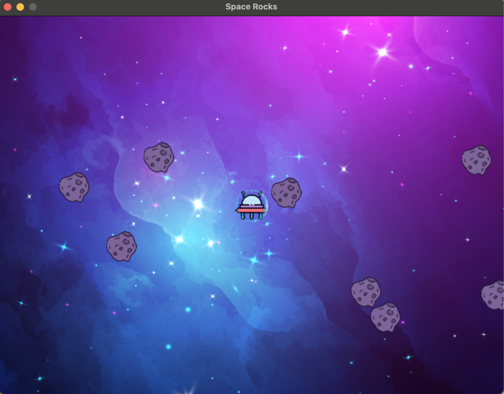
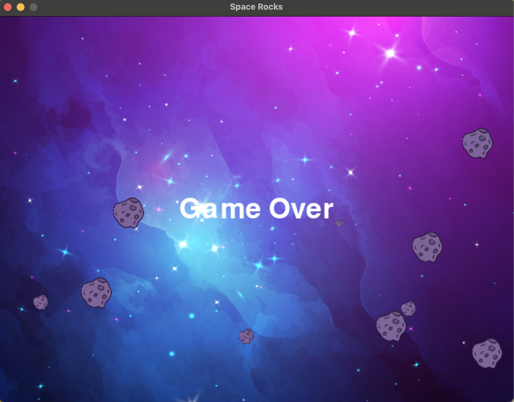
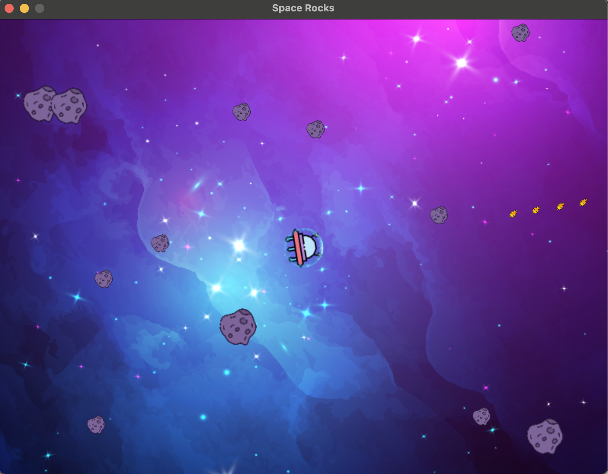

# Space Shooter
- Space Shooter is a 2D shooting game built using Pygame 2.3.0. In this game, the player controls a spaceship and shoots down the enemy spaceships while avoiding their attacks. The game is designed to be fast-paced and challenging, with different types of enemies and power-ups that can be collected.
- 
- 
- 

# Installation
- To install Space Shooter, you will need to have Python 3.7 or higher and Pygame 2.3.0 installed on your system. You can install Pygame using pip, by running the following command in your terminal:

- pip install pygame==2.3.0
Once you have installed Pygame, you can clone the repository or download the project files from GitHub.

# Usage
- To start the game, navigate to the project directory in your terminal and run the following command:

python __main__.py
- This will launch the game window, and you can use the arrow keys to move your spaceship and the spacebar to shoot. The game will continue until your spaceship is destroyed, or you complete all the levels.

# Files
- The following files are included in the project:

- __main__.py: This is the main Python script that launches the game window and handles the game loop.
- space_shooter.py: This script contains the main game logic, including the game objects, collision detection, and level progression.
- models.py: This script contains the classes for the game objects, such as the spaceship, bullets, and enemies.
- utils.py: This script contains utility functions used throughout the game, such as loading game assets and playing sounds.
- assets/sounds/: This directory contains the sound effects used in the game.
- assets/images/: This directory contains the image assets used in the game.
